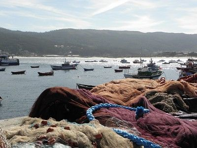

# Meet our newest Maintainer: A. Alonso Dominguez

<CaptionedImg src={require("./splash.jpeg").default}></CaptionedImg>

I was born in the early 80's in a small fishing town in the Spanish Atlantic Coast, far away from the big urban sprawls and common traits of miles-long beaches, year-round summertime and chill out vibes normally identified with life in Spain. This is the autonomous region named Galicia…

<!--truncate-->

Welcome to our newest Maintainer, Alonso! He joined the team this April as a Contributor and recently was elected to the highly trusted role of Maintainer. Among [Alonso's contributions to Pants](https://github.com/pantsbuild/pants/commits?author=alonsodomin) so far:

- Improvements to Coursier handling, and bug reports upstream.
- Support for generating Java code from WSDL files.
- A surprisingly complete Helm backend, which he kindly split into multiple commits for review, and followed with a series of further improvements to the Helm backend.
- Added support for JVM memory controls, and per-process options.
- Implemented transitive file dependencies for tests.
- Feedback on the JVM backend in general, and assistance to other JVM users in Slack.
- Advocated for Pants with new JVM adopters in Slack.

Alonso has consistently been a pleasure to work with during code review, and has become known for his thoughtful design decisions. But all of this is the professional side alone. I recently invited him to introduce himself in-depth to the community, and was delighted to get this personal story in return. Enjoy!

---

["Laxe, Costa da Morte"](https://www.flickr.com/photos/24326886@N03/4204899447) by [amaianos](https://www.flickr.com/photos/aamaianos/)

_I was born in the early 80's in a small fishing town in the Spanish Atlantic Coast, far away from the big urban sprawls and common traits of miles-long beaches, year-round summertime and chill out vibes normally identified with life in Spain. This is the autonomous region named Galicia and here winters are tough, the coast line is gnarly and the seas are rough (a part of it's even dubbed as '[The Coast of Death](https://www.spain-holiday.com/Finisterre/articles/galicias-dramatic-coast-of-death)'!); in short, a paradise for nature lovers._

_Spain was starting its third attempt at democracy and opening itself to the world with a lot of new technology arriving to the common people. The tough winters, my curiosity and long time spent indoors motivated the self-learner in me into learning BASIC. By my teenage years I was already coding in Turbo Pascal and some Delphi. Good and reliable Internet was not a thing at the time in that part of the world, so all copy-pasting had to be done manually typing the code I could find in books and magazine articles of the time, a habit that I still carry out today when learning new languages or tools._

_Being raised surrounded by the beautiful landscapes of the Spanish North-West I also developed quite a lot of interest in photography and outdoor activities. While growing up I was always the kid that pretended to be into mainstream sports (i.e. basketball, football/soccer, etc) just to feel accepted in the small community I belonged to. But as a teenager I developoed the personal confidence to stop pretending and to give a go at hiking, skiing and surfing, enjoying the feeling of freedom of being in nature. My interest in photography took me in the opposite direction of technology, developing a fetish for analog photography (and its whole DIY process). The pursuit of freedom in the outdoors took me to the sky, becoming a skydiver in my early 30's, which is the sport I dedicate most of my free time to nowadays._

_Supported by family, I left my hometown while I still was in my teens; searching for learning and career growth opportunities. Initially not far away from home, I moved into the cities of Santiago de Compostela and A Coruña. Then the global financial crisis brought me to London and Manchester in the UK. After many years away, some of my roots starting calling back. So I returned to Spain, into the sunny city of Barcelona where I'm now based._

_Thanks to working in many different projects and companies from small to big tech (i.e. Booking.com), making some contributions to OSS projects, and self-teaching myself new languages and programming practices I decided to become an independent Software Engineer Consultant a couple of years ago. My interest in [Pants](https://pantsbuild.org/) and monorepos in general comes from the overhead that comes from maintaining multiple small repositories that are part of a larger system that needs to be kept cohesive and up-to-date._

_Unfortunately monorepos are not yet a very common thing in the industry and most of the tools designed to work with them feel a bit clunky, not very onboarding-friendly and demand a considerable amount of effort from repository maintainers. So it was a great relief to find Pants since — from the very first moment of using it — it was easy to understand that the team had in mind to solve those specific problems in its design by providing [dependency inference](https://www.pantsbuild.org/docs/how-does-pants-work#dependency-inference) and goals like \`[tailor](__GHOST_URL__/tailoring-pants-to-your-codebase/)\`. Very shortly after trying it out, I was convinced that even though Pants didn't have as wide a range of features and tool chains as a tool like Bazel, it was worth contributing to Pants to help it grow and become the best multi-paradigm monorepo build tool._

---

🟩

Interesting in joining Pants team too? Terrific! We regularly usher in new teammates, and we are happy to offer mentorship to support your goals. Here's where to learn more about [who is on the team](https://www.pantsbuild.org/docs/team) , [how the community and team are structured](https://www.pantsbuild.org/docs/the-pants-community), and [some of the varied paths that led others to Pants team](__GHOST_URL__/tag/meet-the-team/).